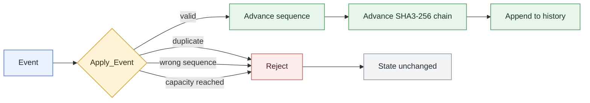

# Sentinel Ledger

A small tamper-evident event ledger built in **SPARK/Ada** to explore how software invariants can be mechanically verified rather than only tested.



## Verified properties

GNATprove checks that:

- accepted events advance the sequence exactly once and update the SHA3-256 chain
- duplicate, out-of-order, and over-capacity events are rejected
- rejected events leave the complete ledger state unchanged
- accepted events append to a bounded history of 256 entries without altering earlier entries

**Slice 5:** all **182 proof checks** passed.

## Build and prove

```sh
alr build
alr run
alr gnatprove --mode=prove --level=2 --report=all --no-subprojects
```

## Scope

This is a compact high-assurance systems prototype, not a production blockchain or distributed ledger. The append-only guarantee applies to `Apply_Event`; the state is not yet encapsulated, persisted, or independently checked against the recorded hash chain.
